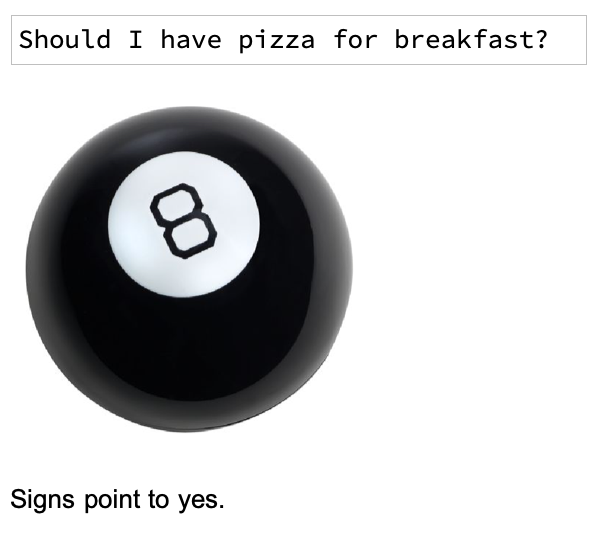

## Introduction

In this project, you will create a Magic 8 Ball which can read minds! Well, not exactly. But you can make the user think that it is reading their mind. You will build a simple Magic 8 Ball which returns a randomly selected answer, and then you will add in some sentiment analysis to give the user the kind of answer they're hoping for.

### What you will make

--- collapse ---
---
title: What you will need
---
### Hardware

+ A computer: desktop, laptop, or a Raspberry Pi

### Software

+ Wolfram Language, available for free on the Raspberry Pi as part of the official operating system, Raspbian

--- /collapse ---

--- collapse ---
---
title: What you will learn
---

+ How to use Sentiment Analysis to choose outputs
+ How to use buttons and input fields to add interactivity
+ How to manipulate lists

--- /collapse ---

--- collapse ---
---
title: Additional information for educators
---

If you need to print this project, please use the [printer-friendly version](https://projects.raspberrypi.org/en/projects/c3-wolfram-magic-8-ball/print){:target="_blank"}.

--- /collapse ---
