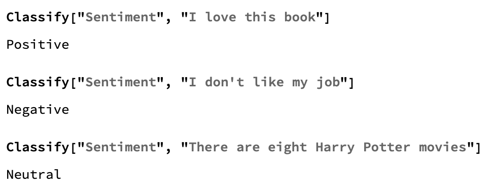

## Add sentiment analysis

Sentiment analysis is the attempt to recognise 'happy' words and 'sad' words in a sentence, and then work out if the feeling behind the sentence is positive, negative, or neutral.
Wolfram has a sentiment classifier built in. You can input a phrase or sentence, and it will classify the text as generally positive, negative, or neutral.




--- task ---
Make an `InputField` so that the user can put in their question, and make a `Button` to deliver a response. Keep the response random for now.

``` 
answer = "Concentrate on your question";
{InputField[Dynamic[question], String], 
 Button["Answer",
  Dynamic[answer = RandomChoice[allresponses]
   ]
  ]}
Dynamic[answer]

```
--- /task ---

Next, make a `Which` statement to choose a response based on the sentiment analysis. Sentiment analysis lets the computer guess the kind of feelings expressed in a piece of text. If the sentiment is positive, the Magic 8 Ball should return a positive statement, if the sentiment is negative, it should return a negative statement, and if the sentiment is neutral, it should return a non-committal statement.

If you are familiar with other programming languages, you might notice that a `Which` statement is similar to an If, Else statement. `Which` takes a series of options, and instructions for what to do when each option is selected. It will return the outcome of the first possibility which returns True.

 --- task ---
Create a `Which` statement which returns a random negative response to a question showing a negative sentiment, a random non-committal response to a question showing a neutral sentiment, and a random positive response to a question showing a positive sentiment.
 
 ```
Which[
 Classify["Sentiment", question] == "Negative", 
 answer = RandomChoice[negatives], 
 Classify["Sentiment", question] == "Neutral", 
 answer = RandomChoice[noncommittal], 
 Classify["Sentiment", question] == "Positive", 
 answer = RandomChoice[positives]]
 ```
 --- /task ---

--- task ---
 Test the `Which` statement with a few different questions to check that it is giving positive, negative, or neutral responses. If you like, you can use these questions, or you can think of your own.
 
 ```question = "Do I love puppies?"```
 
 ```question = "Is my phone broken?"```
 
 ```question = "Should I go running?"```
--- /task ---
 
--- task ---
Add this `Which` statement into the `InputField` and `Button` interface.
 
 ```
 answer = "Concentrate on your question";
{InputField[Dynamic[question], String], 
 Button["Answer",
  Which[
    Classify["Sentiment", question] == "Negative", 
    answer = RandomChoice[negatives], 
    Classify["Sentiment", question] == "Neutral", 
    answer = RandomChoice[noncommittal], 
    Classify["Sentiment", question] == "Positive", 
    answer = RandomChoice[positives]]
  ]}
Dynamic[answer]
```
--- /task ---

--- task ---
Now, test it out! You will need to change the question in the `InputField` box, and press the button, in order to change the answer.
--- /task ---
