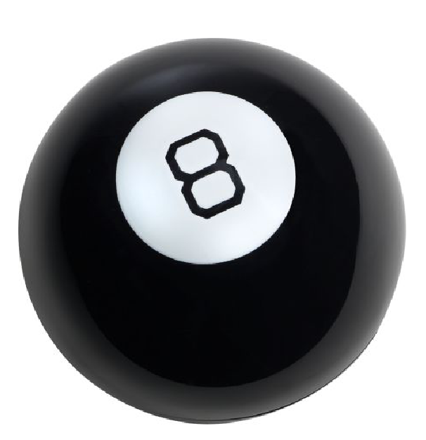
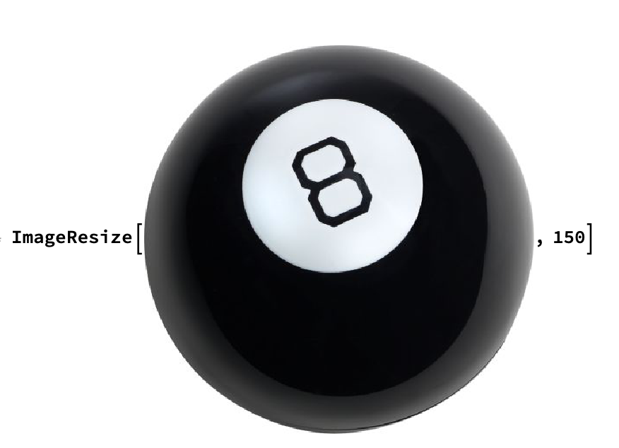

## Designing the User Interface

Let's create a user interface, so that the results are presented cleanly, clearly, and interestingly.

--- task ---
Import an image of a magic 8 ball to accompany your interface.





Copy/paste the image into the notebook, and use `ImageResize` to resize the image so that it is a 150 pixel square.


--- /task ---

--- task ---

When you run the code for `ImageResize`, the output will be the resized image.

Click on the resized image and assign the image to variable name `eightButton`.

--- /task ---
 
--- task ---
Change the button to look like a magic 8 ball instead of saying 'Answer'.
Remove the frame around the button using `Appearance->None`.
Present your interface using `Column`.
Make the output strings look like text instead of code using the `Text` function.

```
answer = Text["Concentrate on your question"];
Column[{question = "Should I have pizza for breakfast?";
  InputField[Dynamic[question], String], 
  Button[eightButton,
   Dynamic[
    Which[
     Classify["Sentiment", question] == "Negative", 
     answer = RandomChoice[negatives],
     Classify["Sentiment", question] == "Neutral", 
     answer = RandomChoice[noncomittal], 
     Classify["Sentiment", question] == "Positive", 
     answer = RandomChoice[positives]
     ]
    ],
   Appearance -> None]
  }]
Dynamic[Text[answer]]
```

 --- /task ---
